# interstellar_fijo — Custom Linux Distro

## Base Used

- **Base distribution:** Linux Mint (64-bit)
- **Image name:** `interstellar_fijo.iso`
- **Integrity verification:** `interstellar_fijo.sha256`

## List of Modifications

| # | Modification | Description |
|---|---------------|--------------|
| 1 | Switched theme to Arc Dark | Replaced the default desktop environment theme with **Arc Dark**. |
| 2 | Installed qBittorrent | Included the **qBittorrent** torrent client pre-installed. |
| 3 | Installed and configured Neovim | Installed **Neovim** along with a custom configuration (plugins, keybindings, and personal settings). |
| 4 | Custom skel | Modified the `/etc/skel` directory so new users created on the system inherit a personalized base configuration. |

## Justification for Each Modification

### 1. Switch to Arc Dark theme
Arc Dark was chosen for its lower resource usage compared to heavier themes, in addition to offering a visually more comfortable interface (reduced eye strain) for extended use sessions, while keeping a modern and professional look.

### 2. qBittorrent
qBittorrent was included as the torrent client because it is free and open-source software, with no ads or unwanted bundled add-ons (unlike clients such as uTorrent), and it has a low system resource footprint.

### 3. Neovim and custom configuration
Neovim was chosen over traditional Vim for its better support of modern plugins, LSP (Language Server Protocol) integration, and greater customization capability. The custom configuration speeds up editing and development tasks directly from the terminal, without relying on a heavy IDE.

### 4. Custom skel
Modifying `/etc/skel` ensures that every new user account created on the system starts with a consistent base configuration (including Neovim settings, shortcuts, and visual preferences), avoiding the need to manually configure each new user.

## Boot Screenshots

Installation of vitual environment (Linux Mint) and Cubic installation on VM
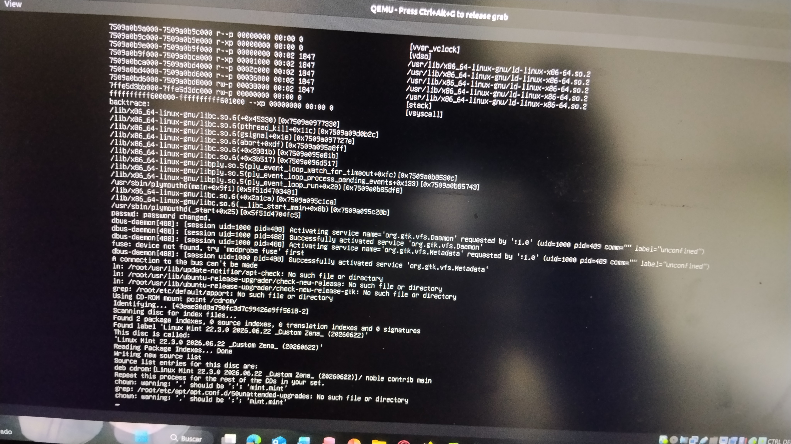
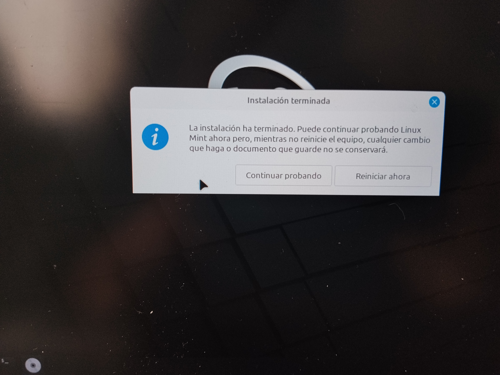
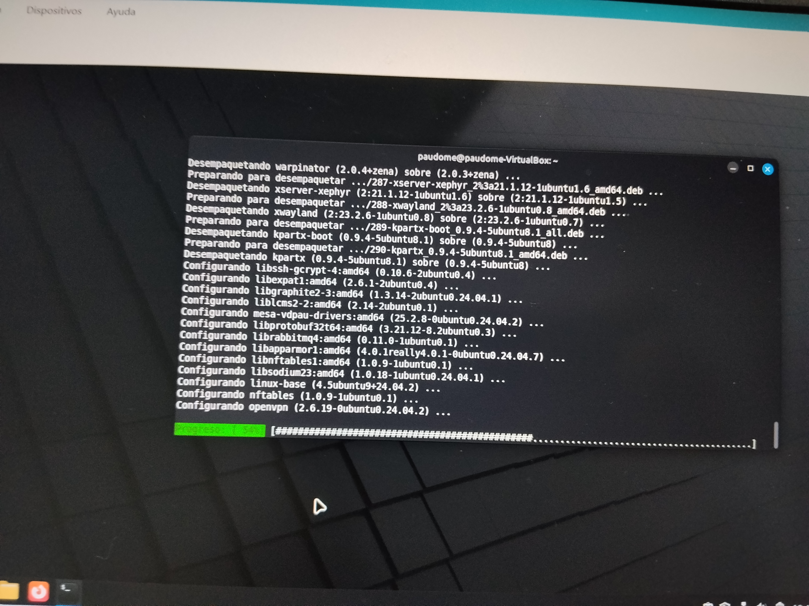
Screenshots relevant to the installation of LM.
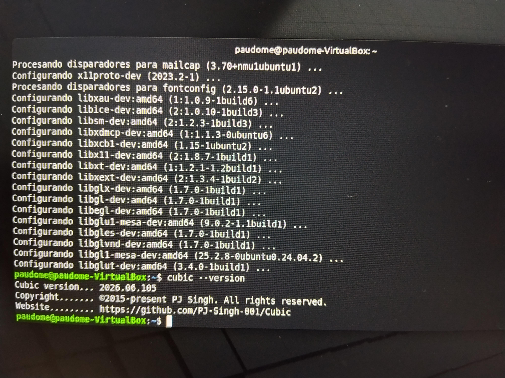
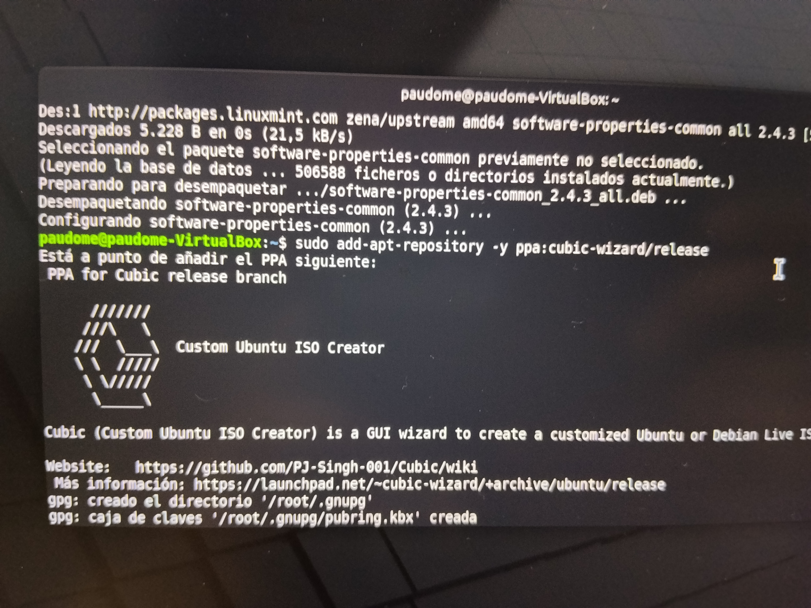
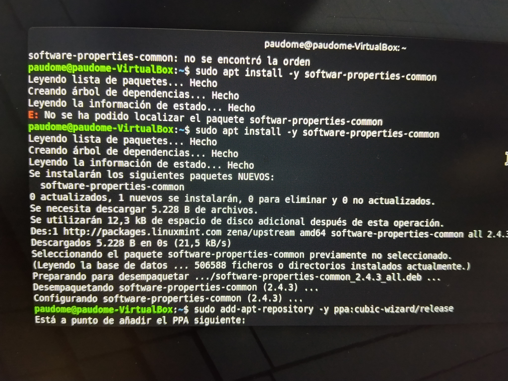

Screenshots relevant to the complete process of installing Cubic.

Opening of Cubic and creation of the distro with customizations
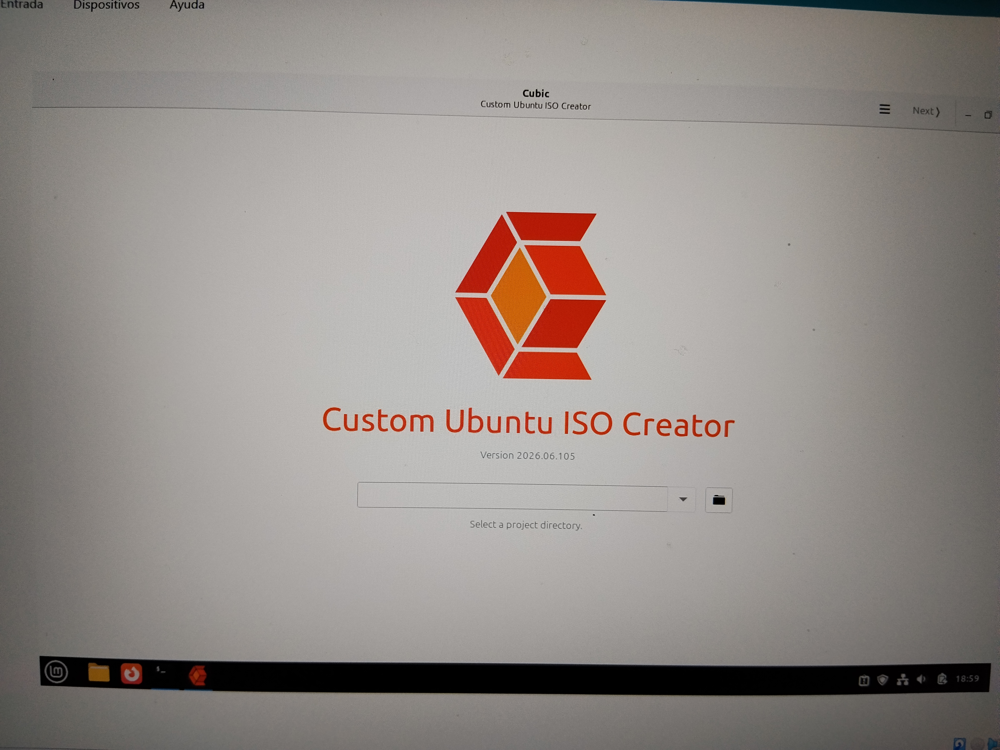
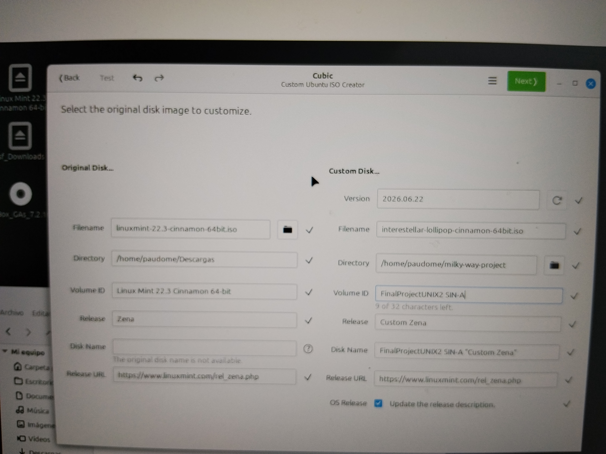
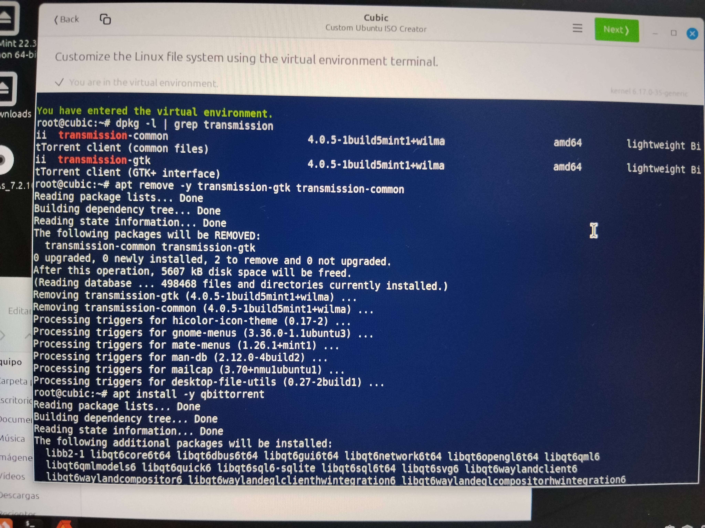
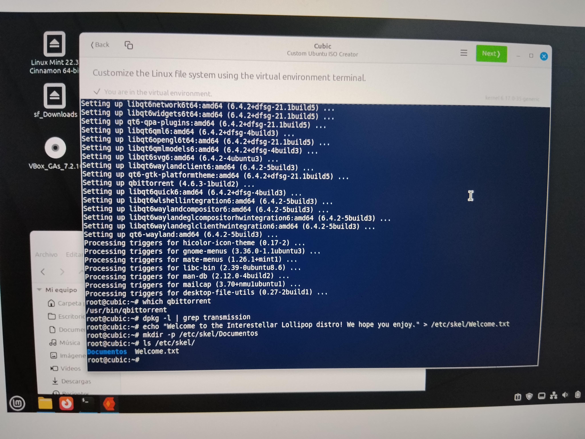
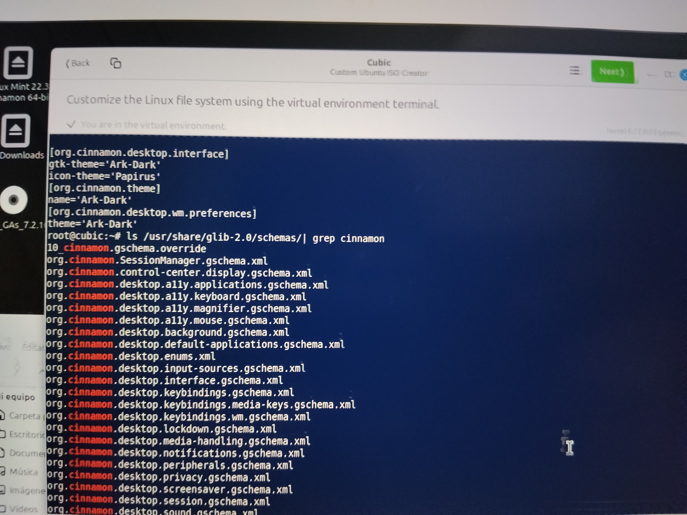
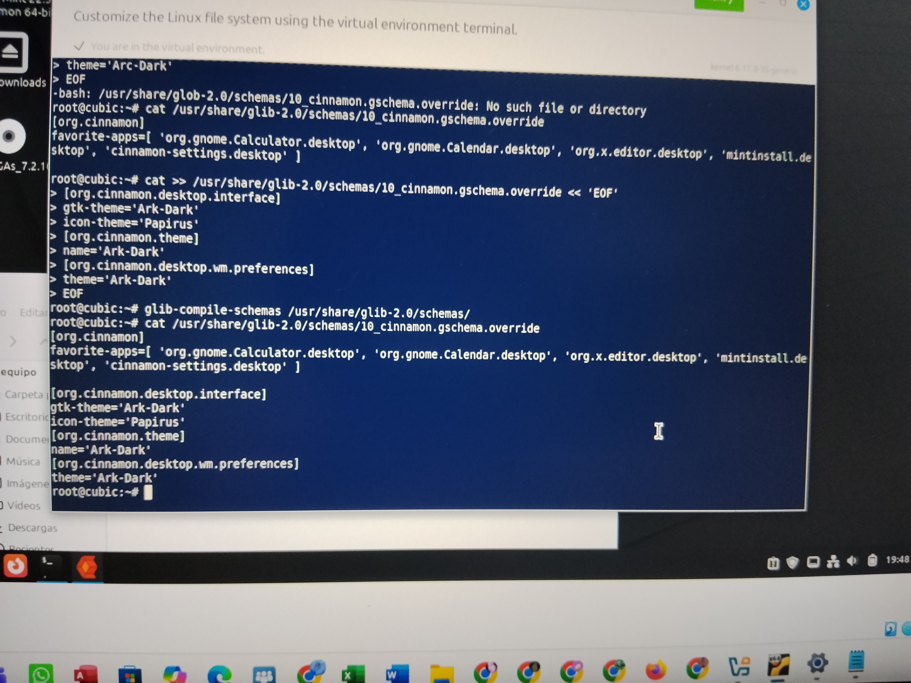
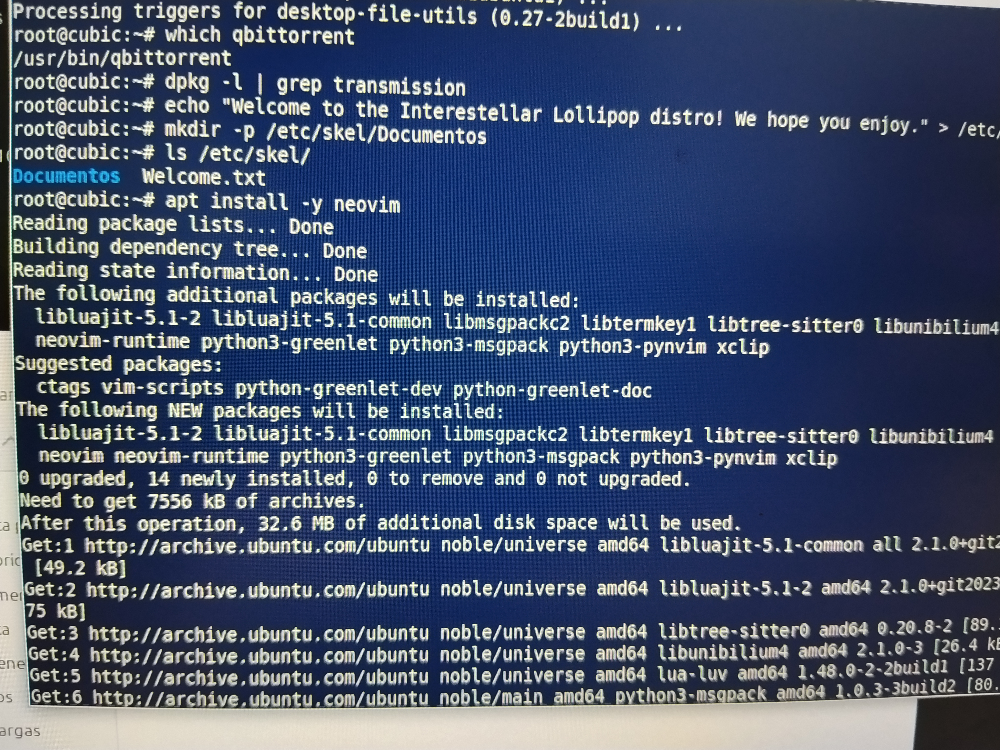

Final distro configurations
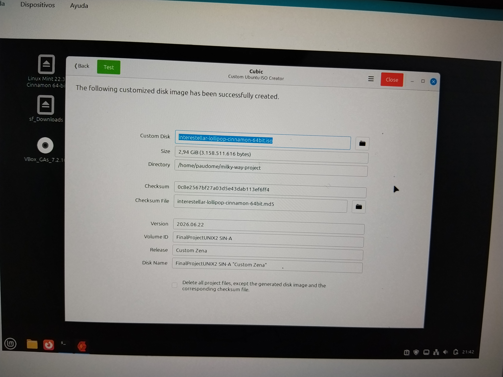

**SHA256 checksum:** `interstellar_fijo.sha256`