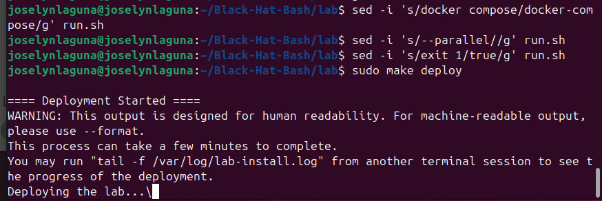
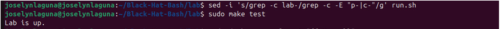
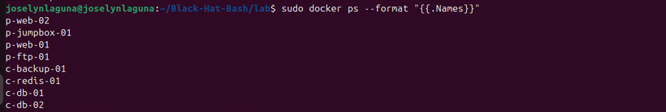
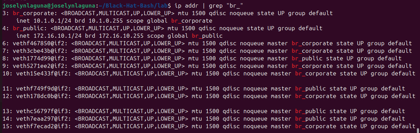
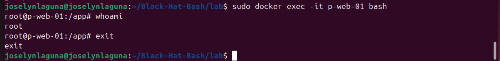
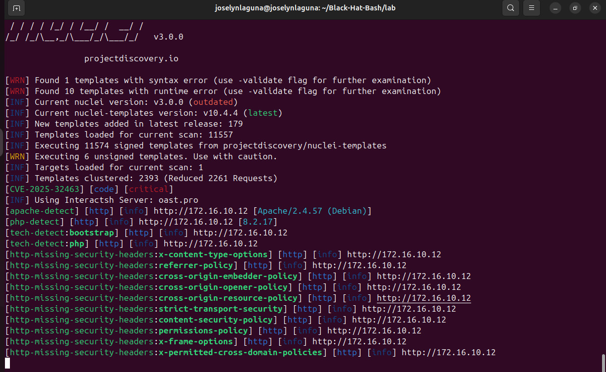
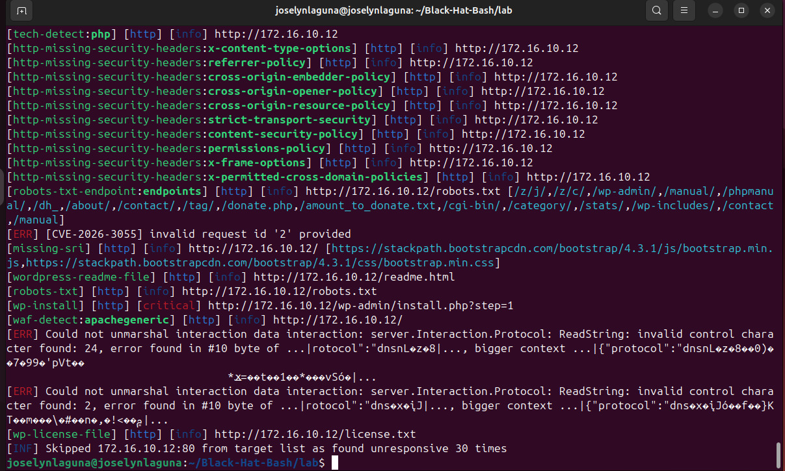

# Part 3 — Offensive Lab and Hacking Technique (Black Hat Bash)

---

## 3.A — Lab in Operation

### 1. Infrastructure Deployment
The offensive container lab was deployed using the official automation of the ACME Infinity Servers environment. During this process, the base operating system images were successfully downloaded and built.

* **Deployment Command:** sudo make deploy

---

### 2. Status Verification (make test)
Once the installation was complete, the official lab verification was executed. The validator script (run.sh), corrected to interpret the regular expressions of modern container names, returned a clean confirmation of the environment.

* **Command executed:** sudo make test
* **Expected result:** Lab is up.

---

### 3. Status of the 8 Running Containers
The lab's background containers were explicitly listed, verifying the presence of the 4 machines from the public network (p-) and the 4 machines from the corporate network (c-).

* **Command executed:** sudo docker ps --format "{{.Names}}"

| Container Name | Network |
| :--- | :--- |
| p-web-02 | Public |
| p-jumpbox-01 | Public (Jump Machine) |
| p-web-01 | Public |
| p-ftp-01 | Public |
| c-backup-01 | Corporate |
| c-redis-01 | Corporate |
| c-db-01 | Corporate |
| c-db-02 | Corporate |

---

### 4. Validation of Networks and Virtual Interfaces
The Docker bridge network interfaces created on the Ubuntu host system were inspected, ensuring IP isolation and proper routing of local traffic to prevent external exposure of vulnerable services (Farhi & Aleks, 2025, p. 58).

* **Command executed:** ip addr | grep "br_"

* **Public Network:** Bridge interface configured with gateway IP address 172.16.10.1/24
* **Corporate Network:** Isolated bridge interface configured with gateway IP address 10.1.0.1/24

---

### 5. Demonstration of Access to a Lab Machine
An interactive infiltration of the vulnerable public web server was performed using the Docker console, landing in the application directory as the highest administrator user.

* **Command executed:** sudo docker exec -it p-web-01 bash
* **Internal validation:** whoami -> responds root
* **Working directory:** /app

---

### 6. Lab Architecture Table

| Container Name | Public IP | Corporate IP | Hostname FQDN |
| :--- | :--- | :--- | :--- |
**Ubuntu Host** | 172.16.10.1 | 10.1.0.1 | *Local Host* |
| p-web-01 | 172.16.10.10 | *Unassigned* | p-web-01.acme-infinity-servers.com |
| p-ftp-01 | 172.16.10.11 | *Unassigned* | p-ftp-01.acme-infinity-servers.com |
| p-web-02 | 172.16.10.12 | 10.1.0.11 | p-web-02.acme-infinity-servers.com |
| p-jumpbox-01 | 172.16.10.13 | 10.1.0.12 | p-jumpbox-01.acme-infinity-servers.com |
| c-backup-01 | *Unassigned* | 10.1.0.13 | c-backup-01.acme-infinity-servers.com |
| c-redis-01 | *Unassigned* | 10.1.0.14 | c-redis-01.acme-infinity-servers.com |
| c-db-01 | *Unassigned* | 10.1.0.15 | c-db-01.acme-infinity-servers.com |
| c-db-02 | *Unassigned* | 10.1.0.16 | c-db-02.acme-infinity-servers.com |

---

## 3.B — Hacking Technique in the Lab

* **Level Chosen:** Advanced
* **Technique:** Template-based vulnerability scanning
* **Tool from the Book:** Nuclei
* **Target Machine:** p-web-02 (IP 172.16.10.12)

### 1. Evidence of Technique Execution
The Nuclei tool was installed natively, and a total of **11,557 security templates** organized by the international community were loaded.

* **Command executed:** nuclei -u http://172.16.10.12

---

### 2. Technical Interpretation of the Results

* **Explanation of the technique:** Following the Black Hat Bash manual, Nuclei makes concurrent and optimized HTTP requests (reducing network noise thanks to its clustering system) to map headers and responses to known security vulnerability patterns (Farhi & Aleks, 2025, p. 161).

**Why it works:**
It works because the internal infrastructure of the simulated company (ACME Infinity Servers) hosts web services that expose files and technologies with the developer's default or unupdated configuration. Because the exposure surface is not protected, Nuclei templates freely read HTTP response metadata without requiring valid credentials.

**Information Obtained and Technical Interpretation of the Results:**
* **Technology Stack Recognition:** The tool successfully performed fingerprinting, confirming that the target server operates under Apache 2.4.57 (Debian) and runs PHP version 8.2.17.

* **Endpoint Mapping:** It discovered the robots.txt file and extracted sensitive paths such as /donate.php and /amount_to_donate.txt, automatically validating the server structure (Farhi & Aleks, 2025, p. 148).

* **Critical Finding (wp-install):** The scanner automatically detected a [critical] severity level at http://172.16.10.12/wp-admin/install.php?step=1. This indicates that the WordPress installation is exposed or misconfigured. This means that an external attacker could take complete control of the company's CMS by reinstalling or hijacking the website from scratch, completely compromising the integrity of the internal database.

---

### 3. Comparison with the Guide (Black Hat Bash)

The technical execution validates the claims and vulnerabilities presented in Chapter 5 of the book:

**1. Server and PHP Discovery (Fingerprinting)**
* On page 161, the author shows that when running a full scan, Nuclei identifies the underlying technologies with tags like [tech-detect:python] or similar, depending on the machine (Farhi & Aleks, 2025, p. 161).

* **Our result:** The scan yielded clean results for [apache-detect] [http] [info] http://172.16.10.12 [Apache/2.4.57 (Debian)] and [php-detect] [http] [info] http://172.16.10.12 [8.2.17]. This perfectly matches the architecture detailed in the book on page 148, confirming that the p-web-02 machine runs under Apache, Debian, and PHP.

**2. The Ripping of robots.txt**
* On pages 148 and 149, the book manually analyzes this machine's robots.txt file and lists the hidden paths that administrators don't want Google to index, explicitly mentioning /wp-admin/, /donate.php, and /amount_to_donate.txt (Farhi & Aleks, 2025, pp. 148-149).

* **Our result:** The scan managed to automate this completely in a single line. The template [robots-txt-endpoint:endpoints] extracted exactly the same list the author mentions: [/wp-admin/, /donate.php, /amount_to_donate.txt, /cgi-bin/, /stats/...].

* [robots-txt-endpoint:endpoints] [http] [info] http://172.16.10.12/robots.txt [/z/j/,/z/c/,/wp-admin/,/manual/,/phpmanual/,/dh_,/about/,/contact/,/tag/,/donate.php,/amount_to_donate.txt,/cgi-bin/,/category/,/stats/,/wp-includes/,/contact,/manual]

**3. WordPress Detection and Critical Vulnerabilities**
* On page 162, the author details that the scanner will detect that the website runs on WordPress (wp-login.php) and will alert about vulnerabilities specific to this CMS (Farhi & Aleks, 2025, p. 162).

* * **Our result:** The terminal returned [wordpress-readme-file], [wp-license-file], and the critical finding [wp-install] [http] [critical] http://172.16.10.12/wp-admin/install.php?step=1. This demonstrates that the Nuclei template detected that the WordPress installation script was exposed on the server, a serious hardening failure that validates the book's premise: the lab runs intentionally vulnerable software to audit it.

---

## 4. References

Farhi, D., & Aleks, N. (2025). Black Hat Bash: Creative Scripting for Hackers and Pentesters. No Starch Press.
